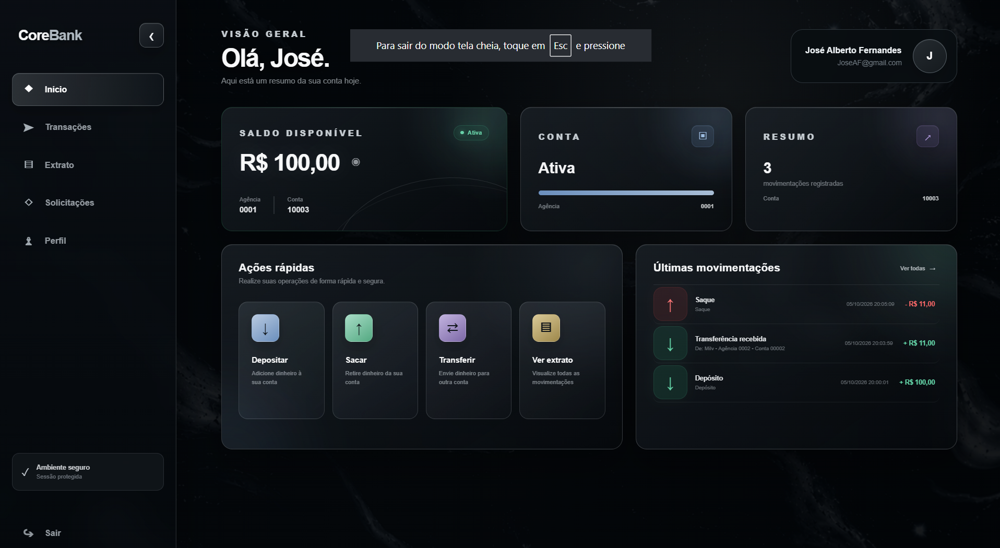
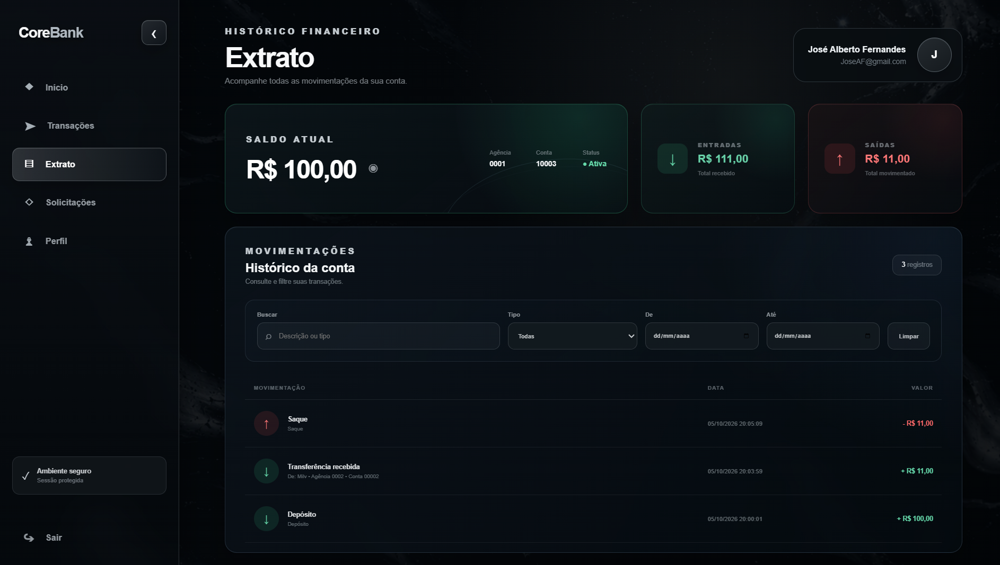
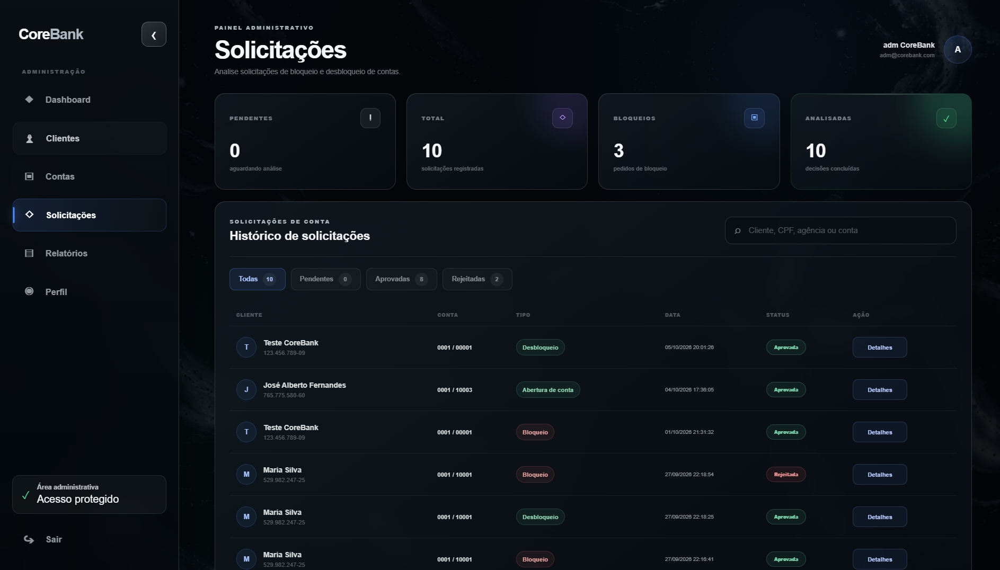
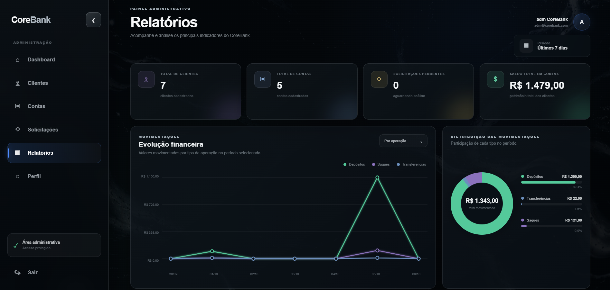

# 🏦 CoreBank

Sistema bancário Full Stack desenvolvido com **C#, ASP.NET Core, Entity Framework Core, SQL Server, React e TypeScript**, estruturado com separação de responsabilidades entre domínio, aplicação, infraestrutura, API e frontend.

O projeto simula operações e fluxos encontrados em um ambiente bancário, incluindo autenticação, gerenciamento de clientes e contas, movimentações financeiras, extrato, solicitações administrativas, abertura e bloqueio de contas, recuperação de senha e relatórios gerenciais.

O CoreBank foi desenvolvido como projeto de estudo e portfólio, com foco em **desenvolvimento backend, APIs REST, banco de dados, regras de negócio, arquitetura em camadas e integração Full Stack**.

---

# 📸 Visão do sistema

## 🔐 Login

Tela de autenticação utilizada para acesso seguro ao CoreBank.


---

## 👤 Dashboard do cliente

O dashboard apresenta uma visão consolidada da conta do cliente, incluindo saldo disponível, status da conta, agência, número da conta, movimentações recentes e atalhos para operações financeiras.



---

## 📜 Extrato bancário

O cliente pode consultar todo o histórico financeiro da conta, acompanhar entradas e saídas e utilizar filtros para localizar movimentações específicas.



---

## 📬 Administração de solicitações

Administradores possuem uma área dedicada à análise e acompanhamento das solicitações realizadas pelos clientes.



---

## 📊 Relatórios administrativos

O painel administrativo apresenta indicadores financeiros e operacionais do CoreBank, permitindo acompanhar clientes, contas, solicitações e movimentações.



---

# 🎯 Objetivo do projeto

O CoreBank foi criado para aplicar conceitos utilizados no desenvolvimento de sistemas corporativos e financeiros.

O projeto trabalha principalmente com:

- Arquitetura em camadas
- Orientação a objetos
- APIs REST
- Autenticação e autorização
- Regras de negócio
- Persistência de dados
- Entity Framework Core
- Migrations
- Relacionamentos entre entidades
- Operações financeiras
- Validação de dados
- Tratamento de erros
- Integração frontend/backend
- Interfaces administrativas
- Relatórios gerenciais
- Controle de solicitações
- Histórico de movimentações

---

# 🛠️ Tecnologias utilizadas

## Backend

- C#
- .NET 10
- ASP.NET Core Web API
- Entity Framework Core
- LINQ
- JWT
- BCrypt
- SQL Server
- SQL Server LocalDB
- Swagger / OpenAPI

## Frontend

- React
- TypeScript
- Vite
- React Router
- HTML5
- CSS3
- Fetch API

## Banco de dados

- Microsoft SQL Server
- Entity Framework Core
- Code First
- Migrations

## Ferramentas

- Visual Studio
- Git
- GitHub
- NuGet
- npm
- Swagger

---

# 🏗️ Arquitetura

O backend foi organizado em projetos separados para reduzir o acoplamento e dividir responsabilidades.

```text
CoreBank
│
├── CoreBank.Domain
│   ├── Entities
│   ├── Enums
│   └── Exceptions
│
├── CoreBank.Application
│   └── Regras e casos de uso da aplicação
│
├── CoreBank.Infrastructure
│   ├── Persistência
│   ├── Entity Framework Core
│   ├── DbContext
│   └── Migrations
│
├── CoreBank.Api
│   ├── Controllers
│   ├── Autenticação
│   ├── Configuração
│   └── Endpoints REST
│
├── corebank-web
│   └── Aplicação React + TypeScript
│
└── docs
    └── images
```

### CoreBank.Domain

Representa o núcleo do sistema.

Contém as entidades, enums, exceções e regras diretamente relacionadas ao domínio bancário.

### CoreBank.Application

Responsável pela camada de aplicação e organização dos casos de uso do sistema.

### CoreBank.Infrastructure

Responsável pela persistência dos dados e integração com o SQL Server através do Entity Framework Core.

Também contém as migrations responsáveis pela evolução da estrutura do banco de dados.

### CoreBank.Api

Responsável por disponibilizar as funcionalidades do sistema através de uma API REST.

Recebe as requisições do frontend, executa as regras necessárias e retorna as respostas HTTP.

### corebank-web

Aplicação frontend desenvolvida em React e TypeScript.

Responsável pelas interfaces do cliente e do administrador e pela comunicação com a API CoreBank.

---

# 🧩 Principais entidades

## Customer

Representa um cliente cadastrado no CoreBank.

Entre os dados utilizados estão:

```text
Id
Name
Cpf
Email
PasswordHash
CreatedAt
```

O cadastro do usuário e a existência de uma conta bancária são conceitos separados.

Um usuário pode possuir um perfil no CoreBank antes da aprovação da abertura de sua conta.

---

## Account

Representa uma conta bancária vinculada a um cliente.

Principais informações:

```text
Id
CustomerId
Agency
Number
Balance
Status
CreatedAt
```

Uma conta possui agência, número, saldo e status próprio.

O saldo inicial de uma nova conta é:

```text
R$ 0,00
```

---

## Transaction

Representa uma movimentação financeira.

Principais informações:

```text
Id
AccountId
Type
Amount
Description
RelatedAccountId
CreatedAt
```

O campo `RelatedAccountId` permite relacionar determinadas operações com outra conta, principalmente transferências.

---

## AccountRequest

Representa solicitações relacionadas ao ciclo de vida da conta e aos processos administrativos.

As solicitações ficam disponíveis para análise na área administrativa.

O sistema mantém o histórico das decisões tomadas.

---

# 💰 Operações bancárias

O CoreBank implementa operações financeiras fundamentais.

## Depósito

Adiciona determinado valor ao saldo da conta.

Exemplo:

```text
Saldo atual: R$ 100,00
Depósito:    R$ 500,00

Novo saldo: R$ 600,00
```

A operação também gera uma movimentação no histórico.

---

## Saque

Remove determinado valor do saldo.

Antes da operação, o domínio valida se existe saldo suficiente.

Exemplo:

```text
Saldo: R$ 500,00
Saque: R$ 200,00

Novo saldo: R$ 300,00
```

Uma tentativa de retirar um valor superior ao disponível é rejeitada.

Exemplo de regra:

```text
Saldo insuficiente.
```

---

## Transferência

Permite movimentar valores entre contas.

A operação registra as duas perspectivas da transferência:

```text
TransferSent
TransferReceived
```

Dessa forma, o histórico consegue identificar corretamente quem enviou e quem recebeu o valor.

---

# 📑 Tipos de transação

As movimentações financeiras são classificadas através de `TransactionType`.

```text
Deposit = 1
Withdrawal = 2
TransferSent = 3
TransferReceived = 4
```

Essa estrutura facilita consultas, relatórios e representação das operações no frontend.

---

# 🚦 Status da conta

As contas possuem status próprio através de `AccountStatus`.

O status é utilizado pelas regras de negócio para determinar quais operações podem ser realizadas.

A interface também apresenta visualmente a situação atual da conta.

---

# 🔐 Autenticação e segurança

O CoreBank possui fluxo de autenticação para controle de acesso.

Após um login válido, a API retorna um token utilizado pelo frontend para acessar recursos protegidos.

O frontend envia o token nas requisições autenticadas:

```http
Authorization: Bearer TOKEN
```

Entre os mecanismos utilizados no projeto estão:

- autenticação baseada em token;
- JWT;
- hash de senha;
- BCrypt;
- separação entre cliente e administrador;
- rotas protegidas;
- validação de operações no backend;
- controle de acesso aos endpoints.

Senhas não devem ser armazenadas diretamente em texto puro.

---

# 👥 Perfis de acesso

O CoreBank possui dois contextos principais.

## Cliente

O cliente possui acesso às funcionalidades bancárias relacionadas à própria conta.

Entre elas:

- dashboard;
- saldo;
- depósito;
- saque;
- transferência;
- extrato;
- histórico de movimentações;
- solicitações;
- perfil.

## Administrador

O administrador possui uma interface separada para gerenciamento da plataforma.

Entre as funcionalidades estão:

- dashboard administrativo;
- gerenciamento de clientes;
- gerenciamento de contas;
- análise de solicitações;
- acompanhamento de indicadores;
- relatórios;
- perfil administrativo.

---

# 🏦 Fluxo de abertura de conta

No CoreBank, **criar um perfil não significa criar automaticamente uma conta bancária**.

Esse comportamento foi implementado para separar cadastro e aprovação bancária.

O fluxo funciona da seguinte maneira:

```text
Cadastro
   ↓
Perfil criado
   ↓
Solicitação de abertura
   ↓
Análise administrativa
   ↓
Aprovação
   ↓
Conta criada
   ↓
Acesso aos serviços bancários
```

Quando um usuário recém-cadastrado ainda não possui conta, ele recebe uma interface específica para solicitar a abertura.

Enquanto a solicitação estiver em análise, o sistema informa seu status.

Após a aprovação e criação da conta, o usuário passa a ter acesso ao ambiente bancário completo.

---

# 🔒 Bloqueio e desbloqueio

O CoreBank diferencia uma pessoa que **nunca teve uma conta** de um cliente cuja conta já existe, mas foi bloqueada.

Uma conta bloqueada continua existindo.

Nesse cenário, o cliente utiliza o fluxo de solicitação de desbloqueio.

O administrador pode analisar a solicitação e decidir pela aprovação ou rejeição.

Isso mantém o histórico da conta e evita tratar um bloqueio como uma nova abertura.

---

# 🔑 Recuperação de senha

O sistema também possui fluxo de recuperação de senha.

A solicitação é integrada ao painel administrativo e pode ser acompanhada juntamente com as demais solicitações.

O histórico diferencia solicitações pendentes das já concluídas, evitando que solicitações anteriormente analisadas permaneçam contabilizadas como pendência.

---

# 📬 Sistema de solicitações

A área administrativa centraliza diferentes processos que precisam de análise.

Entre eles:

```text
Abertura de conta
Bloqueio
Desbloqueio
Recuperação de senha
```

Cada solicitação possui seu próprio status.

A interface administrativa permite acompanhar:

- total de solicitações;
- solicitações pendentes;
- aprovadas;
- rejeitadas;
- solicitações analisadas;
- histórico;
- cliente relacionado;
- conta relacionada;
- tipo;
- data;
- status.

Também existe indicação visual de novas pendências no menu administrativo.

---

# 📊 Relatórios administrativos

O CoreBank possui uma área de relatórios para acompanhamento dos principais indicadores da plataforma.

Entre as informações apresentadas estão:

- total de clientes;
- total de contas;
- solicitações pendentes;
- saldo total existente nas contas;
- evolução financeira;
- depósitos;
- saques;
- transferências;
- distribuição das movimentações.

Os gráficos permitem visualizar a movimentação financeira por período e por tipo de operação.

---

# 📜 Extrato

O extrato apresenta as movimentações associadas à conta autenticada.

Entre as informações disponíveis estão:

- saldo atual;
- total de entradas;
- total de saídas;
- descrição da movimentação;
- tipo;
- data;
- valor.

Também foram implementados filtros para facilitar consultas ao histórico.

O usuário pode filtrar movimentações por:

```text
Descrição
Tipo
Data inicial
Data final
```

---

# 🖥️ Dashboard do cliente

O dashboard funciona como a visão geral da conta.

Ele apresenta:

- nome do cliente;
- saldo disponível;
- situação da conta;
- agência;
- número da conta;
- quantidade de movimentações;
- movimentações recentes;
- atalhos para operações financeiras.

As ações rápidas permitem acessar diretamente:

```text
Depositar
Sacar
Transferir
Ver extrato
```

---

# 🧑‍💼 Painel administrativo

O sistema possui uma área específica para administradores.

Sua navegação é separada da área do cliente.

```text
Dashboard
Clientes
Contas
Solicitações
Relatórios
Perfil
```

Isso permite separar operações bancárias comuns das funções administrativas da plataforma.

---

# 🌐 API REST

O frontend se comunica com o backend através de requisições HTTP utilizando JSON.

Exemplo conceitual:

```text
React
   ↓
HTTP Request
   ↓
ASP.NET Core API
   ↓
Application / Domain
   ↓
Entity Framework Core
   ↓
SQL Server
```

A resposta percorre o caminho inverso até ser apresentada na interface.

---

# 🔄 Exemplo de requisição

Uma requisição de autenticação segue o formato:

```http
POST /api/Auth/login
Content-Type: application/json
```

Exemplo de corpo:

```json
{
  "email": "usuario@email.com",
  "password": "senha"
}
```

Após autenticação válida, o token recebido passa a ser utilizado nas requisições protegidas.

---

# 🗃️ Banco de dados

O projeto utiliza SQL Server juntamente com Entity Framework Core.

A criação e evolução do banco são controladas através de migrations.

Entre as principais estruturas estão:

```text
Customers
Accounts
Transactions
AccountRequests
```

Os relacionamentos permitem conectar clientes, contas, movimentações e solicitações.

---

# 🔗 Relacionamentos principais

De forma simplificada:

```text
Customer
   │
   └── Account
          │
          └── Transactions

Customer
   │
   └── AccountRequests
```

As transferências também podem utilizar `RelatedAccountId` para identificar a conta relacionada à movimentação.

---

# ⚙️ Entity Framework Core

O Entity Framework Core é utilizado como ORM da aplicação.

Ele é responsável por mapear objetos C# para estruturas do SQL Server.

O projeto utiliza migrations para versionar alterações no banco.

Exemplo:

```powershell
Add-Migration NomeDaMigration -StartupProject CoreBank.Api
Update-Database -StartupProject CoreBank.Api
```

---

# ▶️ Executando o projeto

## Pré-requisitos

Para executar o CoreBank localmente é necessário possuir:

```text
.NET SDK 10
SQL Server / LocalDB
Node.js
npm
Visual Studio ou IDE compatível
```

---

## 1. Clone o repositório

```bash
git clone https://github.com/ArthurFdSZ/CoreBank.git
```

Entre no diretório:

```bash
cd CoreBank
```

---

## 2. Configure o banco

Verifique a `ConnectionString` da aplicação antes de executar o projeto.

Exemplo de ambiente local:

```json
"ConnectionStrings": {
  "DefaultConnection": "Server=localhost;Database=CoreBank;Trusted_Connection=True;TrustServerCertificate=True;"
}
```

A configuração pode variar de acordo com a instalação do SQL Server.

---

## 3. Aplicar migrations

Utilizando o Package Manager Console:

```powershell
Update-Database -StartupProject CoreBank.Api
```

Ou utilize os comandos equivalentes do .NET CLI caso o ambiente esteja configurado para isso.

---

## 4. Executar a API

Na raiz do projeto:

```bash
dotnet run --project CoreBank.Api
```

Durante o desenvolvimento, a API foi utilizada através do ambiente HTTPS configurado pelo ASP.NET Core.

---

## 5. Instalar o frontend

Entre na aplicação React:

```bash
cd corebank-web
```

Instale as dependências:

```bash
npm install
```

---

## 6. Executar o frontend

```bash
npm run dev
```

O Vite disponibiliza a aplicação localmente durante o desenvolvimento.

Exemplo:

```text
http://localhost:5173
```

---

# 🧪 Build

## Backend

Para validar especificamente a API e suas dependências:

```bash
dotnet build ./CoreBank.Api/CoreBank.Api.csproj
```

## Frontend

Dentro de `corebank-web`:

```bash
npm run build
```

O build do frontend executa a validação TypeScript e gera a versão de produção através do Vite.

---

# 🧪 Testes realizados

Durante o desenvolvimento foram testados os principais fluxos da aplicação.

Entre eles:

- cadastro de usuário;
- login;
- autenticação;
- abertura de conta;
- aprovação administrativa;
- depósito;
- saque;
- validação de saldo insuficiente;
- transferência entre contas;
- registro das duas perspectivas da transferência;
- consulta de extrato;
- filtros do extrato;
- bloqueio;
- desbloqueio;
- recuperação de senha;
- análise de solicitações;
- atualização das pendências administrativas;
- histórico de solicitações;
- dashboard do cliente;
- dashboard administrativo;
- relatórios.

Também foram executados builds separados do backend e frontend para validação final do projeto.

---

# 📌 Regras de negócio implementadas

Algumas das principais regras aplicadas no sistema são:

1. Uma conta inicia com saldo zero.
2. O saldo não pode ficar negativo através de um saque inválido.
3. Um saque superior ao saldo disponível é rejeitado.
4. Transferências registram movimentações relacionadas nas contas envolvidas.
5. Cliente e conta bancária são entidades diferentes.
6. Criar um cadastro não cria automaticamente uma conta bancária.
7. Uma conta nova depende do fluxo de abertura.
8. Contas bloqueadas utilizam desbloqueio, não uma nova abertura.
9. Solicitações administrativas possuem histórico.
10. Solicitações concluídas não permanecem contabilizadas como pendentes.
11. Operações protegidas dependem de autenticação.
12. O cliente acessa informações relacionadas à própria conta.
13. Administradores possuem funções e interface separadas.

---

# 🎨 Interface

A interface foi desenvolvida com identidade visual inspirada em plataformas financeiras modernas.

O design utiliza:

- tema escuro;
- cards;
- transparência;
- hierarquia visual;
- indicadores de status;
- feedback visual para operações;
- navegação lateral;
- dashboards;
- gráficos;
- componentes específicos para cliente e administrador.

O objetivo foi criar uma interface coerente com o contexto de uma aplicação financeira sem comprometer a clareza das informações.

---

# 📂 Estrutura geral

```text
CoreBank/
│
├── CoreBank.Api/
│
├── CoreBank.Application/
│
├── CoreBank.Domain/
│
├── CoreBank.Infrastructure/
│
├── corebank-web/
│
├── docs/
│   └── images/
│       ├── Login.png
│       ├── iniciocliente.png
│       ├── extratocliente.png
│       ├── Solicitacaoadm.png
│       └── Relatorioadm.png
│
├── CoreBank.slnx
│
└── README.md
```

---

# 📈 Evoluções futuras

Como possíveis evoluções do projeto:

- testes unitários;
- testes de integração;
- refresh token;
- paginação;
- auditoria avançada;
- logs estruturados;
- Docker;
- CI/CD;
- notificações;
- confirmação de operações;
- melhorias adicionais de segurança;
- deploy em ambiente cloud.

---

# 💡 Aprendizados

O desenvolvimento do CoreBank permitiu aplicar conceitos de backend e frontend em um projeto integrado.

Entre os principais aprendizados estão:

- organização de soluções .NET;
- arquitetura em camadas;
- criação de APIs REST;
- modelagem de entidades;
- relacionamento entre tabelas;
- utilização do Entity Framework Core;
- migrations;
- implementação de regras de negócio;
- autenticação;
- autorização;
- integração entre React e ASP.NET Core;
- TypeScript;
- tratamento de erros;
- fluxos administrativos;
- construção de dashboards;
- Git e GitHub.

---

# ⚠️ Observação

O CoreBank é um **projeto educacional e de portfólio**.

Não representa uma instituição financeira real e não deve ser utilizado para armazenar dinheiro, dados bancários reais ou executar operações financeiras reais.

---

# 👨‍💻 Autor

**Arthur Farias de Souza**

Projeto desenvolvido para estudo e evolução profissional em desenvolvimento de software, engenharia de software e tecnologia aplicada ao setor financeiro.

---

# 📄 Licença

Projeto desenvolvido para fins educacionais e de portfólio.